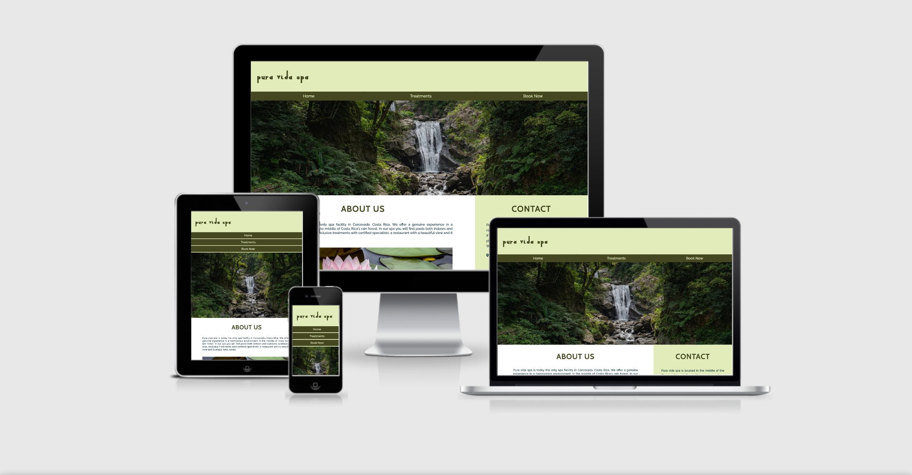

# Pura Vida Spa

Pura Vida Spa is a fictional spa located in the heart of the Costa Rican rainforest. Pura Vida Spa offers a variety of beauty treatments and its location allows you to enjoy their services while surrounded by the beautiful Costa Rican nature.

The purpose of this website is to promote Pura Vida Spa and to provide information to the customers about the spa, its treatments and contact options. The website targets an audience of new customers looking for the treatments being offered as well as recurrent users looking to schedule a new appointments or find out about their new offerings.

Visit the deployed website [here](https://josswe26.github.io/pura-vida-spa/)

## 1. User Experience (UX)

### 1.1. User Stories

* As a business owner, I want the website to have a calming design, appealing to the customers.

* As a business owner, I want to present the treatments offered to attract more customers.

* As a business owner, I want customers to be able to book a treatment once they have decided to visit us.

* As a customer, I want to be able to navigate the website intuitively and learn more about the business and treatments being offered.

* As a customer, I want to be able to read more about the treatments available.

* As a customer, I want to easily find the contact information for the business.

* As a customer, I want to find social media links to the business.

* As a customer, I want to be able to book a treatment directly from the website.

* As a customer, I want to easily find the business' location.

### 1.2. Color Scheme

The colors used in the site are two different tones of green (#e2ecba and #454720), a brown color (#784834) for the hover effects and a blue green color (#133944) for the main text. These colors are chosen to represent the rain forest surrounding the business and are used in order to communicate a sense of calm and relaxation.

### 1.3. Typography

The main font being used in the site is Raleway, with Sans Serif as the fallback font in case Ralway is not being imported correctly. Cabin is being used for the headings, as suggested by Google Fonts for appropriate pairings with Raleway, with Sand Serif as fallback. The Qahiri font has been chosen for the site logo with Sans Serif used again as fallback.

### 1.4. Wireframes

[Balsamiq](https://balsamiq.com/) has been used to showcase the appearance of the site and display the placement of the different elements whitin the pages.

Destop Version | Mobile Version
--- | ---
[Index](assets/wireframes/desktop-index.png) | [Index](assets/wireframes/mobile-index.png)
[Treatments](assets/wireframes/desktop-treatments.png) | [Treatments](assets/wireframes/mobile-treatments.png)
[Book Now](assets/wireframes/desktop-book-now.png) | [Book Now](assets/wireframes/mobile-book-now.png)

## 2. Features

## 3. Technologies Used

### 3.1. Languages Used
* [HTML5](https://en.wikipedia.org/wiki/HTML5)
* [CSS3](https://en.wikipedia.org/wiki/CSS)

### 3.2. Frameworks, Libraries and Programs Used

* [Google Fonts](https://fonts.google.com/ "Link to Google Fonts")
    - Google Fonts was used to import the fonts Raleway, Cabin and Qahiri into the style.css file. These fonts were used throughout the site.
* [Font Awesome](https://fontawesome.com/ "Link to FontAwesome")
     - Font Awesome was used throughout all pages to add icons in order to create a better visual experiience for UX purposes.
* [TinyPNG](https://tinypng.com/)
    - TinyPNG was used to reduce the file size of the images for the website.
* [GitPod](https://gitpod.io/ "Link to GitPod homepage")
     - GitPod was used for writing code, commiting, and then pushing to GitHub.
* [GitHub](https://github.com/ "Link to GitHub")
     - GitHub was used to store the project after pushing.
* [Balsamiq](https://balsamiq.com/ "Link to Balsamiq homepage")
     - Balsamiq was used to create the wireframes during the design phase of the project.
* [Am I Responsive?](http://ami.responsivedesign.is/# "Link to Am I Responsive Homepage")
    - Am I Responsive was used in order to see responsive design throughout the process and to generate mockup imagery to be used.
* [Responsive Design Checker](https://www.responsivedesignchecker.com/)
    - Responsive Design Checker was used in the testing process to check responsiveness on various devices.
* [W3C Markup Validator](https://validator.w3.org/)
    - W3C Markup Validator was used to validate the HTML code.
* [W3C CSS Validator](https://jigsaw.w3.org/css-validator/)
    - W3C CSS Validator was used to validate the CSS code.

## 4. Testing

## 5. Deployment

## 6. Credits 

