# Pura Vida Spa

Pura Vida Spa is a fictional spa located in the heart of the Costa Rican rainforest. Pura Vida Spa offers a variety of beauty treatments and its location allows you to enjoy their services while surrounded by the beautiful Costa Rican nature.

The purpose of this website is to promote Pura Vida Spa and to provide information to the customers about the spa, its treatments and contact options. The website targets an audience of new customers looking for the treatments being offered as well as recurrent users looking to schedule a new appointments or find out about their new offerings.

Visit the deployed website [here](https://josswe26.github.io/pura-vida-spa/)

## Table of Contents

1. [User Experience (UX)](#user-experience-ux)
    1. [Project Goals](#project-goals)
    2. [User Stories](#user-stories)
    3. [Color Scheme](#color-scheme)
    4. [Typography](#typography)

2. [Features](#features)
    1. [General](#general)
    2. [Landing Page](#landing-page)
    3. [Treatments Page](#treatments-page)
    4. [Book Now Page](#book-now-page)
    5. [404 Error Page](#404-error-page)

 3. [Technologies Used](#technologies-used)

    1. [Languages Used](#languages-used)
    2. [Frameworks, Libraries and Programs Used](#frameworks-libraries-and-programs-used)

4. [Testing](#testing)
    1. [Testing User Stories](#testing-user-stories)
    2. [Code Validation](#code-validation)
    3. [Accessibility](#accessibility)
    4. [Tools Testing](#tools-Testing)
    5. [Manual Testing](#manual-testing)

5. [Finished Product](#finished-product)

6. [Deployment](#deployment)
    1. [GitHub Pages](#github-pages)

7. [Credits](#credits)
    1. [Content](#content)
    2. [Media](#media)
    3. [Code](#code)

8. [Acknowledgements](#acknowledgements)

***

## User Experience (UX)

### Project Goals

* The website should have a calming and relaxing design, appealing to the customers.

* Present the treatments offered and information about them in order to attract more customers.

* Provide the customer with useful information tha can facilitate future interaction with the business.

* Offer the customers the opportunity to book a treatment once they have decided to visit the business.

### User Stories

* As a customer, I want to be able to navigate the website intuitively and learn more about the business and treatments being offered.

* As a customer, I want to be able to read more about the treatments available.

* As a customer, I want to easily find the contact information for the business.

* As a customer, I want to find social media links to the business.

* As a customer, I want to be able to book a treatment directly from the website.

* As a customer, I want to easily find the business' location.

### Color Scheme

The colors used in the site are two different tones of green (#e2ecba and #454720), a brown color (#784834) for the hover effects and a blue green color (#133944) for the main text. These colors are chosen to represent the rain forest surrounding the business and are used in order to communicate a sense of calm and relaxation.

### Typography

The main font being used in the site is Raleway, with Sans Serif as the fallback font in case Ralway is not being imported correctly. Cabin is being used for the headings, as suggested by Google Fonts for appropriate pairings with Raleway, with Sand Serif as fallback. The Qahiri font has been chosen for the site logo with Sans Serif used again as fallback.

### Wireframes

[Balsamiq](https://balsamiq.com/) has been used to showcase the appearance of the site and display the placement of the different elements whitin the pages.

Desktop Version | Mobile Version
--- | ---
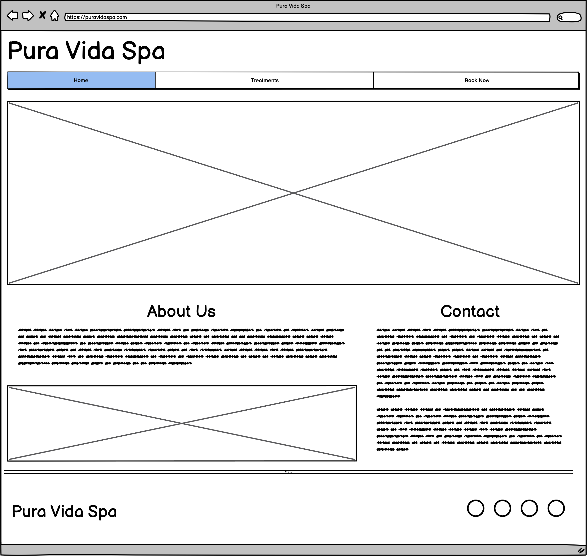 | 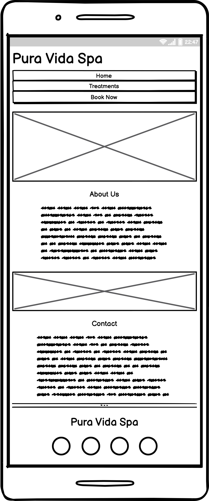
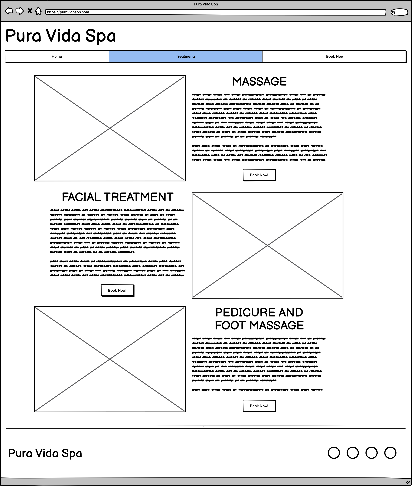 | 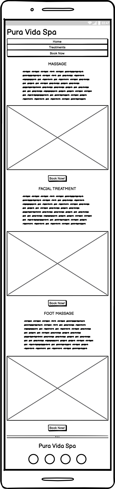
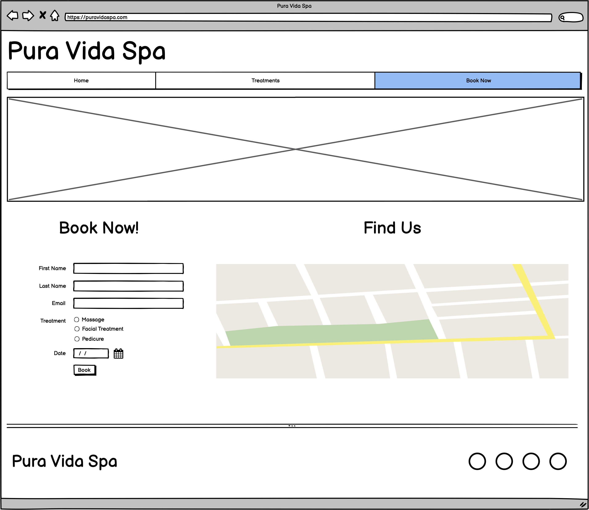 | 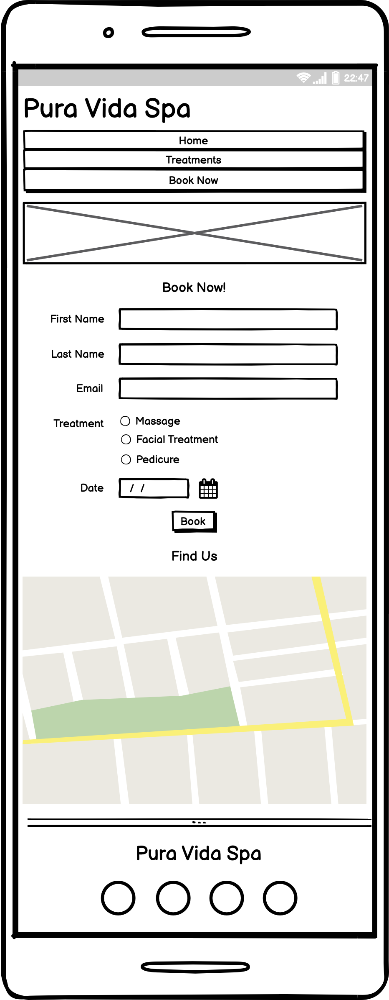

[Back to top ⇧](#pura-vida-spa)

## Features

### General

* Responsive design across all device sizes.

* Similar color scheme and design throughout all pages to effectively structure, categorise and present the information to the customers.

* **Header**

    
    - The header contains the business logo and fully responsive navigation bar positioned across the top of the screen.

    - The business logo functions as a link to the landing page.

    - The navigation bar is identical in all pages and contains links to all pages to facilitate navigation across the site. It also has a hover effect that changes color to provide feedback to the customer for a better user experience.

* **Footer**

    - The footer includes a smaller version of the logo and link to the business' social media channels.

### Landing Page

* **Main Image**
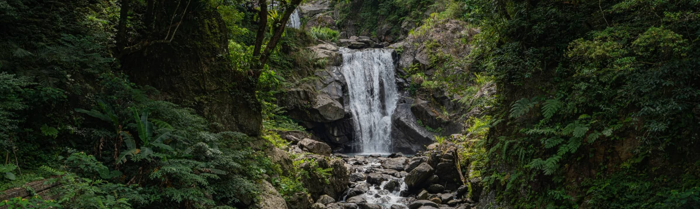

    - The main image is designed to attract the customer's attention and represents the nature surrounding the business.

* **About Us Section**

    - Contains a text with information about the business as well as an eye-catching image.

* **Contact Section**

    - Contains a text with useful geographical information as well as contact details such as the business' physical address, email and phone number.

### Treatments Page

* **Treatment Sections**

    - The treatment section contains an image to illustrate the respective treatment and a short text with an explanation of the treatment.

    - A link to the book now page has been added to each section for easy navigation.

    - Each treatment section is fully responsive and easy to replicate in case more treatments need to be added by the business.

### Book Now Page

* **Book Now Form**
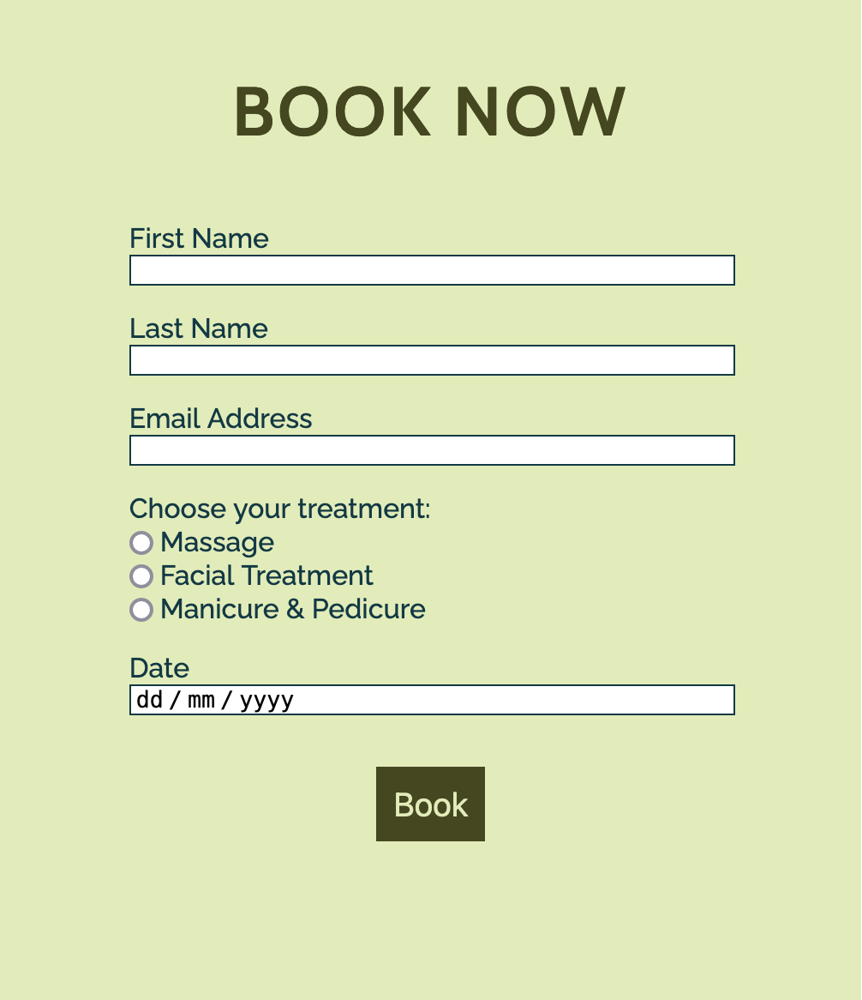

    - The form allows the customer to book the desired treatment on a specific date directly from the business' website.

* **Find Us Section**

    - This section displays a Google map of the business' geographical location. This allows the customers to easily find the location from their devices.

### 404 Error Page

*  This single page is being shown in case the customer enters an incorrect address into the address bar. It contains a link to the landing page.

[Back to top ⇧](#pura-vida-spa)

## Technologies Used

### Languages Used
* [HTML5](https://en.wikipedia.org/wiki/HTML5)
* [CSS3](https://en.wikipedia.org/wiki/CSS)

### Frameworks, Libraries and Programs Used

* [Google Fonts](https://fonts.google.com/)
    - Google Fonts was used to import the fonts Raleway, Cabin and Qahiri into the style.css file. These fonts were used throughout the site.

* [Font Awesome](https://fontawesome.com/)
     - Font Awesome was used throughout all pages to add icons in order to create a better visual experience for UX purposes.

* [TinyPNG](https://tinypng.com/)
    - TinyPNG was used to reduce the file size of the images for the website.

* [GitPod](https://gitpod.io/)
     - GitPod was used for writing code, committing, and then pushing to GitHub.

* [GitHub](https://github.com/)
     - GitHub was used to store the project after pushing.

* [Balsamiq](https://balsamiq.com/)
     - Balsamiq was used to create the wireframes during the design phase of the project.

* [Am I Responsive?](http://ami.responsivedesign.is/#)
    - Am I Responsive was used in order to see responsive design throughout the process and to generate mockup imagery to be used.

* [Responsive Design Checker](https://www.responsivedesignchecker.com/)
    - Responsive Design Checker was used in the testing process to check responsiveness on various devices.

* [Chrome DevTools](https://developer.chrome.com/docs/devtools/)
    - Chrome DevTools was used during development process for code review and to test responsiveness.

* [W3C Markup Validator](https://validator.w3.org/)
    - W3C Markup Validator was used to validate the HTML code.

* [W3C CSS Validator](https://jigsaw.w3.org/css-validator/)
    - W3C CSS Validator was used to validate the CSS code.

[Back to top ⇧](#pura-vida-spa)

## Testing

### Testing User Stories

* As a customer, I want to be able to navigate the website intuitively and learn more about the business and treatments being offered.

     - The website offers a intuitive structure for the customers to navigate and find the information they are looking for.

    - The navigation bar is clearly presented in all pages for the customers to find with ease and it is easily navigable.

* As a customer, I want to be able to read more about the treatments available.

    - The treatments page presents all treatments available, each on their own section.

    - Each treatment section contains useful information about the respective treatment.

* As a customer, I want to easily find the contact information for the business.

    - The landing page contains a clear contact section with all necessary business' contacts

* As a customer, I want to find social media links to the business.

    - The footer provides link to the business' social media channels.

* As a customer, I want to be able to book a treatment directly from the website.

    - The book now page provides a book now form for the customer to book and schedule their next treatment.

* As a customer, I want to easily find the business' location.

    - The book now page contains a find us section with a Google map of the business' geographical location.

### Code Validation

* The [W3C Markup Validator](https://validator.w3.org/) and [W3C CSS Validator](https://jigsaw.w3.org/css-validator/) services were used to validate all pages of the project in order to ensure there were no syntax errors.

    - W3C Markup Validator found an error concerning headings not being included on the main and book now images. The section tag was replaced for a div tag to correct this. 
    
    - Another error found by W3C Markup Validator was concerning a percentage value used inside the iframe tag to declare the width property on the Book Now page. The width and height properties for the iframe were declared inside the CSS file instead.

    -  W3C CSS Validator found no errors or warnings on my CSS.

### Accessibility

* Used Lighthouse in Chrome DevTools to confirm that the colors and fonts being used in throughout the website are easy to read and accessible.

* Lighthouse reports

    - **Landing Page**

    

    - **Treatments Page**

    

    - **Book Now Page**

    

    - **404 Error Page**

    

### Tools Testing

* [Chrome DevTools](https://developer.chrome.com/docs/devtools/)

    - Chrome DevTools was used during the development process to test, explore and modify HTML elements and CSS styles used in the project.

* Responsiveness
    
    - [Am I Responsive?](http://ami.responsivedesign.is/#) was used to check responsiveness of the site pages across different devices.

    - [Responsive Design Checker](https://www.responsivedesignchecker.com/) was used to check responsiveness of the site pages on different screen sizes.
    
    - Chrome DevTools was used to test responsiveness in different screen sizes during the development process.

### Manual Testing

* Browser Compatibility

    - The website has been tested on the following browsers:

        - **Goolgle Chrome**
        
        No appearance, responsiveness nor functionality issues.

        - **Safari**
        
        No appearance, responsiveness nor functionality issues.

        - **Mozilla Firefox**
        
        There was and issue with the appearance of the book buttons on the treatments page expanding all the width. This issue was corrected by changing the width property value from "fit-content" to "max-content".
        
        No responsiveness nor functionality issues.

        - **Microsoft Edge**
        
        No appearance, responsiveness nor functionality issues.

* Device compatibility

    - The website has been tested on multiple devices, including:

        - **MacBook Pro 15"**

        No appearance, responsiveness nor functionality issues.

        - **Dell Latitude 5300**

        No appearance, responsiveness nor functionality issues.

        - **iPad Pro 12.9"**

        No appearance, responsiveness nor functionality issues.

        - **iPad Pro 10.5"**

        No appearance, responsiveness nor functionality issues.

        - **iPhone XR**
        
        No appearance, responsiveness nor functionality issues.

        - **iPhone 7**

        No appearance, responsiveness nor functionality issues.

* Common Elements Testing

    - All Pages
        
        - **Header**

            - Clicking on the main logo will bring the customer back to the landing page.

        - **Navigation Bar**

            - Hovering on the different navigation bar's links will trigger hover effect, highlighting the link for the customer.

            - Clicking on the navigation bar's links will bring the customer to the specified page.
        
        - **Footer**
        
            - Clicking on the social media links will open the specific website on a new tab.

    - Treatments Page

        - Hovering on the book button link on each treatment section will trigger hover effect, highlighting the button for the customer.

        - Clicking on the book button link on each treatment section will bring the customer to the book now page.

    - Book Now Page

        - When filling out the book now form, the customer is required to complete all fields before submitting.
        
        - Hovering over the book button will trigger hover effect, highlighting the button for the customer.

        - Clicking and dragging on the map in the find us section will move the area shown on the map. 
        
        - Clicking the plus and minus buttons changes the zoom of the map.

    - 404 Error Page

        - Entering an incorrect address into the address bar will bring the customer back to the 404 error page.

        - Hovering on the homepage link will trigger hover effect, increasing the font size of the link's text.

        - Clicking on the homepage link will bring the customer back to the landing page.

[Back to top ⇧](#pura-vida-spa)

## Finished Product

Desktop version | Mobile version
--- | ---
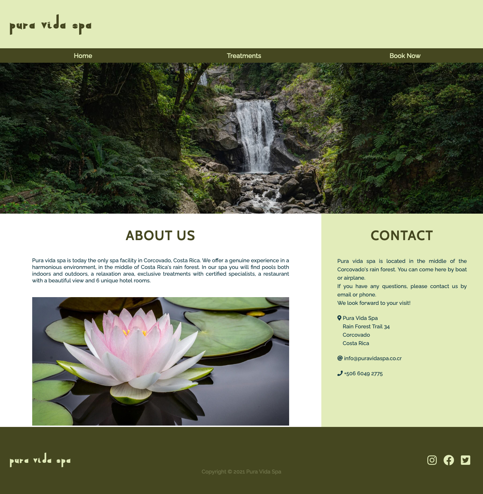 | 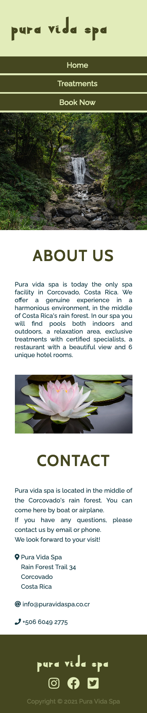
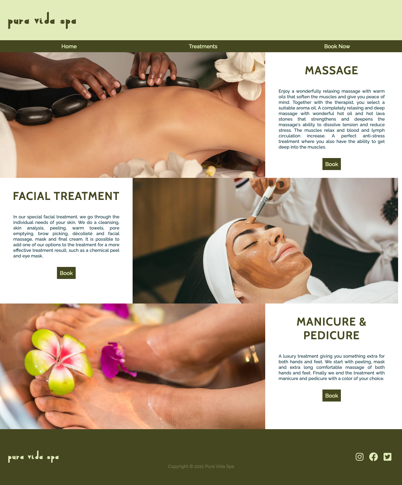 | 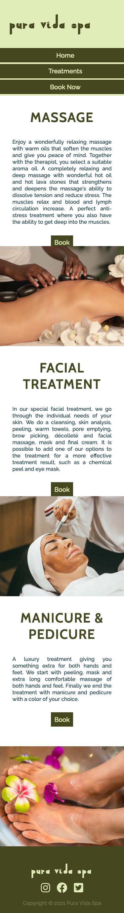
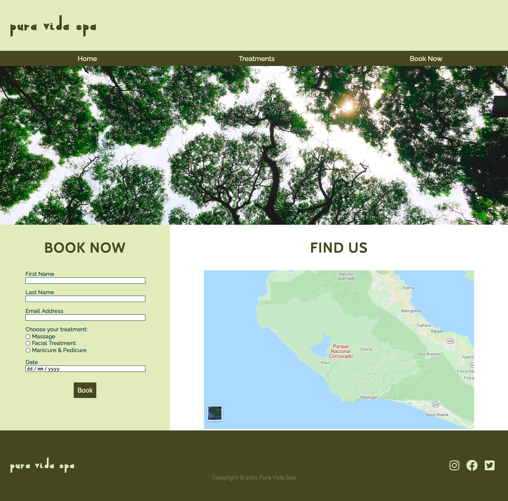 | 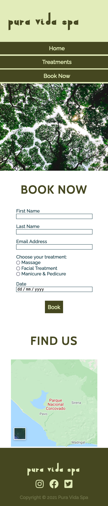
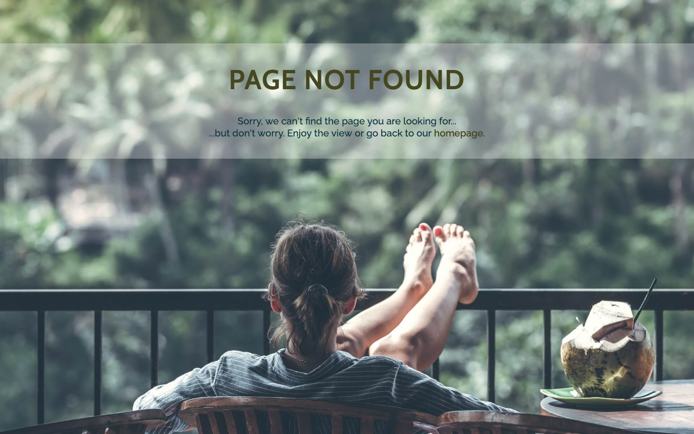 | 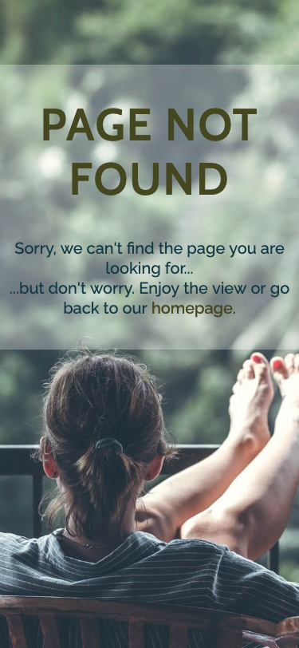

[Back to top ⇧](#pura-vida-spa)

## Deployment

* This website was developed using [GitPod](https://www.gitpod.io/), which was then committed and pushed to GitHub using the GitPod terminal.

### GitHub Pages

* Here are the steps to deploy this website to GitHub Pages from its GitHub repository:

    1. Log in to GitHub and locate the [GitHub Repository](https://github.com/).

    2. At the top of the Repository, locate the Settings button on the menu.

        - Alternatively click [here](https://raw.githubusercontent.com/) for a GIF demostration of the process.

    3. Scroll down the Settings page until you locate the Pages section.

    4. Under Source, click the dropdown called None and select Master Branch.

    5. The page will refresh automatically and generate a link to your website.

[Back to top ⇧](#pura-vida-spa)

## Credits 

### Content

- All content was written by the developer.

### Media

* [Pexels](https://www.pexels.com/)

    - Main image: "Waterfalls in the Middle of Green Trees" by Austin Tsai.
    - 404 Error Page image: Taken by Artem Beliaikin.

* [Unsplash](https://unsplash.com/)

    - About Us image: "Pristine water lily" by Jay Castor.
    - Massage image: "Beautiful Woman Getting Stones Massage in Spa Salon" by Engin Akyurt.
    - Facial image: Taken by Raphael Lovaski.
    - Pedicure image: "Warm bath before treatment" by Rune Enstad.
    - Book Now image: Taken by Firos Nv.

### Code

* [Stack Overflow](https://stackoverflow.com/) and [W3Schools](https://www.w3schools.com/) were consulted on a regular basis for inspiration and sometimes to be able to better understand the code being implement.

[Back to top ⇧](#pura-vida-spa)

## Acknowledgements

* My partner, for her unconditional love, help and support in all aspects of life to make possible for me to work on this project.

* My family, for their valuable opinions and and critic during the design and development process.

* My tutor, Marcel, for his invaluable feedback and guidance.

* Code Institute and its amazing Slack community for their support and providing me with the necessary knowledge to complete this project.

[Back to top ⇧](#pura-vida-spa)